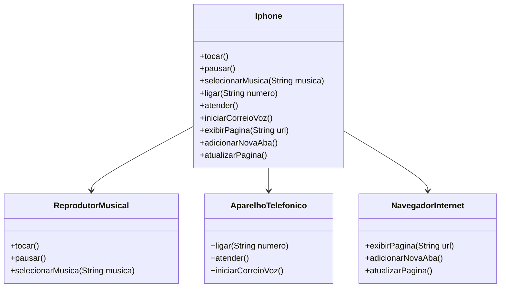

# 📱 Projeto: Componente iPhone - POO com UML

Este projeto é parte de um desafio de modelagem orientado a objetos em Java, inspirado no vídeo de lançamento do iPhone original em 2007. O objetivo foi representar as principais funcionalidades do dispositivo com o uso de **interfaces**, **classes concretas** e um **diagrama UML (Mermaid)**, além da **implementação em Java**.

---

## 🧠 Objetivo do Desafio

Modelar as funcionalidades de um iPhone com base no vídeo oficial de lançamento e aplicar os conceitos fundamentais da Programação Orientada a Objetos:

- **Interface** como contrato
- **Herança e Implementação**
- **Responsabilidade única**
- **Encapsulamento**

---

## 🎯 Funcionalidades Modeladas

O iPhone é composto por três funcionalidades principais:

| Componente             | Métodos                                                                 |
|------------------------|-------------------------------------------------------------------------|
| 🎵 Reprodutor Musical  | `tocar()`, `pausar()`, `selecionarMusica(String musica)`               |
| 📞 Aparelho Telefônico | `ligar(String numero)`, `atender()`, `iniciarCorreioVoz()`             |
| 🌐 Navegador Internet  | `exibirPagina(String url)`, `adicionarNovaAba()`, `atualizarPagina()`  |

---

## 📁 Estrutura do Projeto

```bash
src/
└── iphone/
    ├── AparelhoTelefonico.java
    ├── NavegadorInternet.java
    ├── ReprodutorMusical.java
    ├── Iphone.java
    └── Main.java


### 📱 Diagrama UML - Componente iPhone



📺 Vídeo de Referência
Trecho usado para inspiração:
📽️ Lançamento iPhone 2007 (YouTube)
⏱️ Minuto relevante: de 00:15 até 00:55


